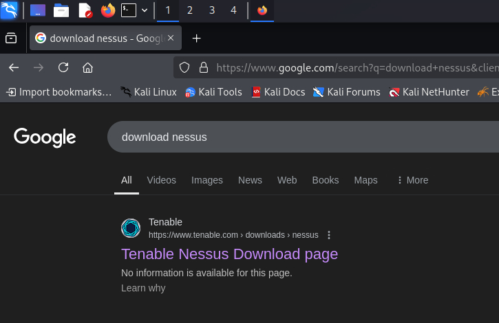
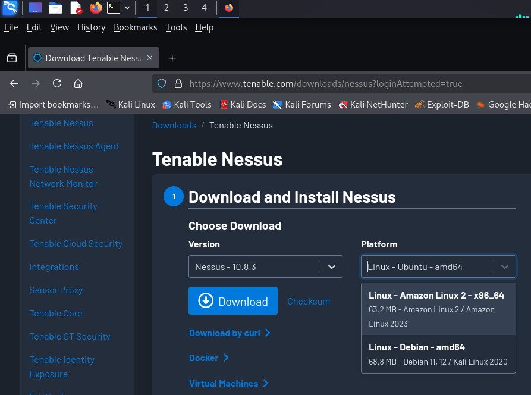
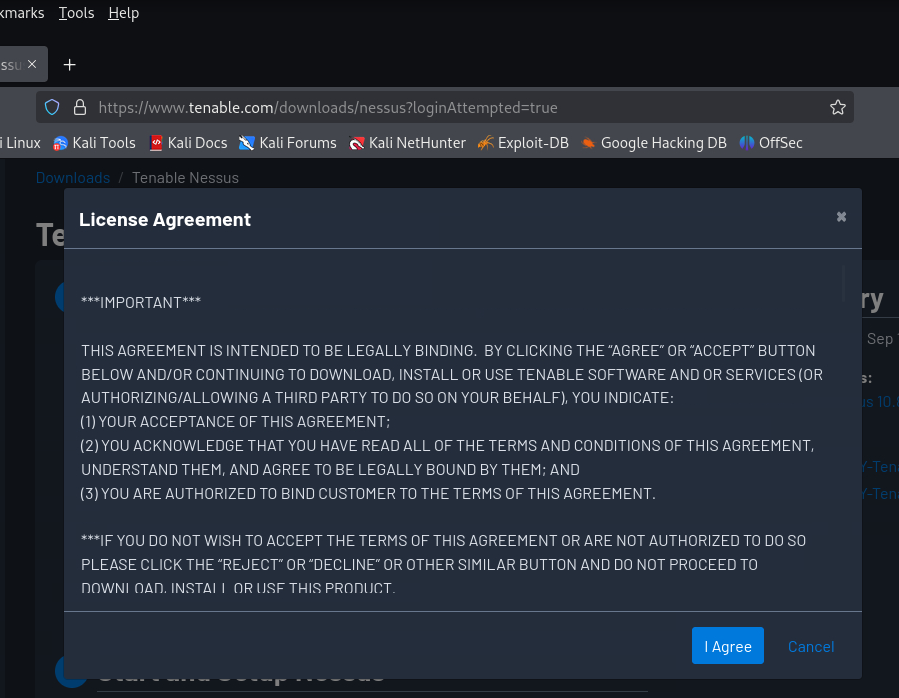
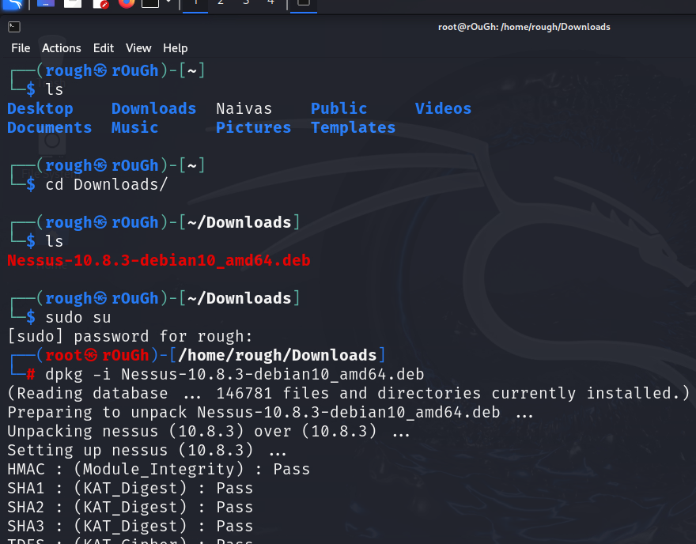
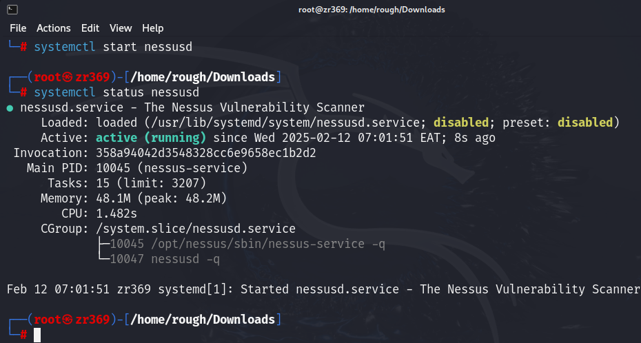
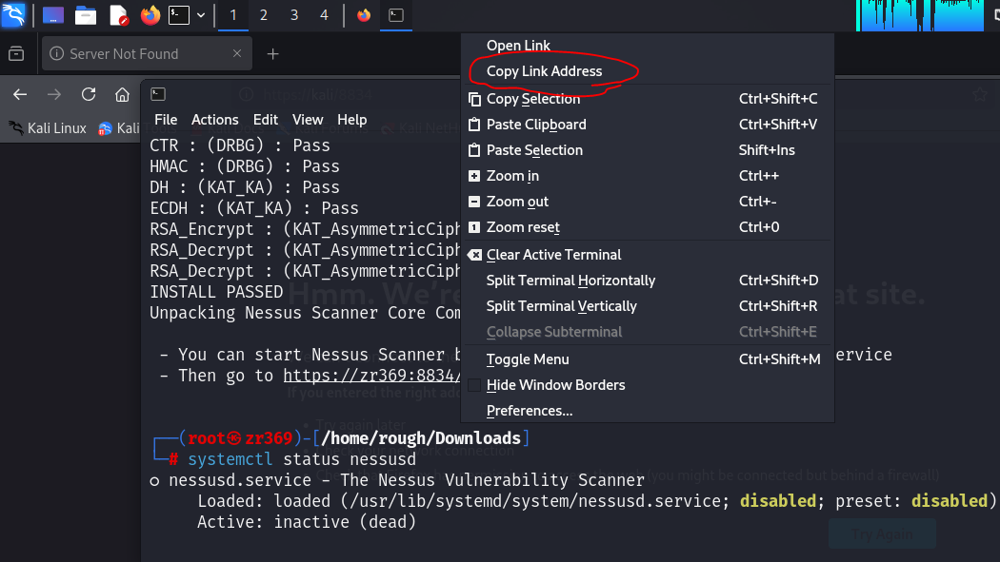

# Nessus-Setup-in-Kali-Linux

<h2>Download Nessus</h2>
Search Nessus Tenable Downloads on google and go to the page with that corresponding name
 

Since we are downloading for linux/or using linux make sure you choose linux Debian amd64 at the Platform
 

 
Click on download and agree on the License Agreement pop up.

Open terminal and navigate to the Downloads directory where nessus is downloaded at.
sudo su to become the root user 
Next is extracting and activating nessus.

dpkg -i Nessus....
system ctl status nessusd (to find out if active or inactive)

system ctl start nessusd (to activate nessus)

open firefox in kali and copy the link provided when activating nessus

